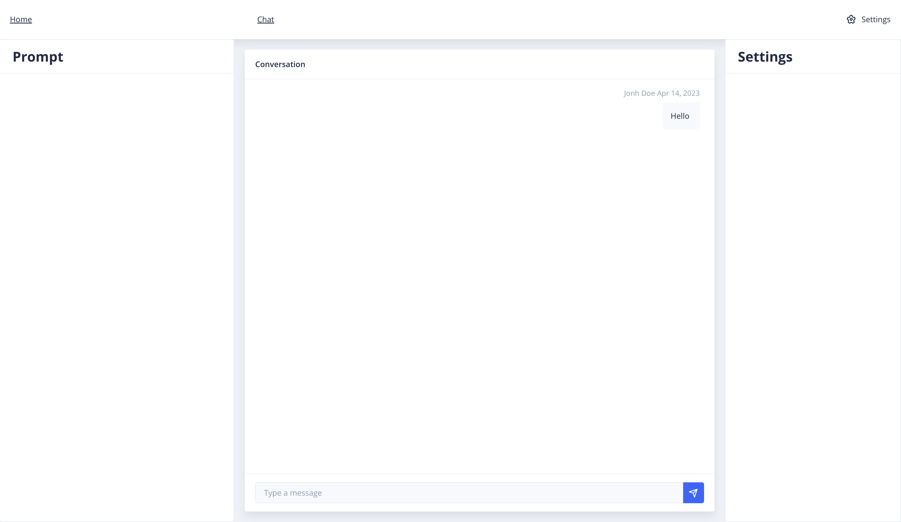

# ChatGPT Wrapper: A Simple and Ready-to-Use Chatbot Solution
ChatGPT Wrapper is a versatile chatbot solution that offers an easy and hassle-free way of integrating OpenAI's GPT language model into your projects. This wrapper consists of a client application written in Angular, utilizing the Nebula UI library, and a backend written in Node.js with Express.js.

With ChatGPT Wrapper, you can create a powerful chatbot that can understand and generate natural language responses with the help of GPT-3.5. The client-side UI is intuitive and easy to use, making it an ideal solution for both novice and experienced developers.

Moreover, the project is built on top of Docker and Docker Compose, allowing for seamless setup and deployment of the application in a containerized environment.

Whether you are looking to develop chatbots for customer service, e-commerce, or any other application, ChatGPT Wrapper offers a reliable and customizable solution. Feel free to use it as you wish and take advantage of the powerful capabilities of GPT-3.5.

# Example UI


# Key Features
- Easy integration with GPT 3/4 and openai API
- Intuitive client-side UI using Angular and Nebula UI library
- Powerful backend using Node.js and Express.js
- Containerized deployment with Docker and Docker Compose
- Customizable and versatile for different use cases

# Getting Started
To get started with ChatGPT Wrapper, simply clone the repository and follow the setup instructions provided in the README file. Once set up, you can start building your chatbot with the help of GPT-3.5 and GPT-4 and the intuitive client-side UI.

to start project simply run:
```bash
docker-compose up -d
```

# Conclusion
ChatGPT Wrapper is an ideal solution for developers who want to create chatbots that can understand and generate natural language responses with ease. With its simple and ready-to-use design, it can be easily customized to suit different use cases. So, feel free to explore and use this project for your own projects, and take advantage of the powerful capabilities of GPT-3.5.
